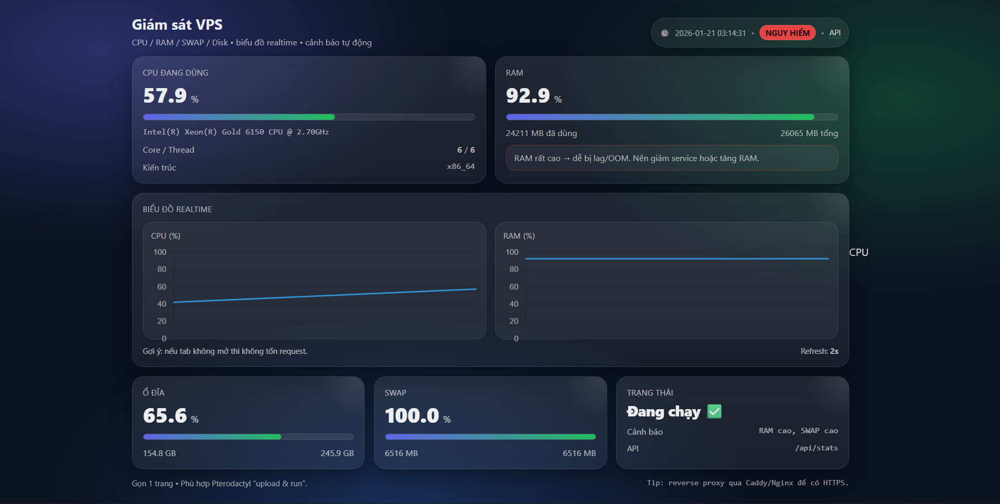

# 📊 VPS Monitor Dashboard

Một **dashboard giám sát VPS / Server đơn giản, hiện đại và siêu nhẹ** để theo dõi tình trạng hệ thống theo thời gian thực.  
Dự án được xây dựng bằng **Python (Flask)** ở backend và **Vanilla JavaScript + Chart.js** ở frontend.



---

## ✨ Giới thiệu

VPS Monitor Dashboard giúp bạn theo dõi nhanh các thông số quan trọng của máy chủ như:

- Mức sử dụng CPU
- Bộ nhớ RAM & SWAP
- Dung lượng ổ đĩa
- Biểu đồ realtime CPU & RAM
- Trạng thái sức khỏe tổng thể của hệ thống

Phù hợp cho:

- 🎓 Demo đồ án / bài tập lớn  
- 🖥️ Quản trị VPS cá nhân  
- ⚙️ Theo dõi server mini, Docker, Pterodactyl  

---

## 🚀 Tính năng nổi bật

- 🔄 **Giám sát thời gian thực**  
  Cập nhật CPU, RAM, Disk, SWAP mỗi 2 giây.

- 📈 **Biểu đồ trực quan**  
  Hiển thị lịch sử sử dụng CPU & RAM bằng biểu đồ đường mượt mà (Chart.js).

- 🧠 **Nhận diện CPU thông minh**  
  Tự động lấy **tên CPU đầy đủ & đẹp** trên cả Windows và Linux  
  (Intel Core, Xeon, AMD EPYC, …).

- ⚡ **Hiệu năng cao – siêu nhẹ**  
  - Backend Flask tối giản  
  - Frontend tự động **tạm dừng cập nhật khi ẩn tab** để tiết kiệm tài nguyên  

- 🔔 **Hệ thống cảnh báo thông minh**  
  Tự động đánh giá trạng thái hệ thống:
  - 🟢 Bình thường  
  - ⚠️ Cảnh báo  
  - 🔴 Nguy hiểm  

---

## 🛠️ Yêu cầu hệ thống

- Python **3.6 trở lên**
- Hệ điều hành: Windows / Linux / VPS / Docker
- Các thư viện trong `requirements.txt`

---

## 📦 Cài đặt & Chạy chương trình

### 1️⃣ Clone hoặc tải dự án

```bash
git clone https://github.com/TroLyAmazon/PteroMon.git
cd PteroMon
````

---

### 2️⃣ Cài đặt thư viện phụ thuộc

```bash
pip install -r requirements.txt
```

---

### 3️⃣ Khởi chạy ứng dụng

```bash
python app.py
```

---

### 4️⃣ Truy cập Dashboard

Mở trình duyệt và truy cập:

👉 **[http://localhost:2026](http://localhost:2026)**

---

## ⚙️ Cấu hình hệ thống

### 🔹 Port chạy ứng dụng

* Mặc định: `2026`
* Có thể thay đổi trong `app.py` hoặc thông qua biến môi trường `PORT`.

---

### 🔹 Ngưỡng cảnh báo tài nguyên

Các ngưỡng cảnh báo được định nghĩa trong file:
`static/app.js`

#### 🖥️ CPU

| Mức sử dụng | Trạng thái         |
| ----------- | ------------------ |
| `< 75%`     | 🟢 **Bình thường** |
| `75% – 89%` | ⚠️ **Cảnh báo**    |
| `≥ 90%`     | 🔴 **Nguy hiểm**   |

---

#### 🧠 RAM

| Mức sử dụng | Trạng thái                                     |
| ----------- | ---------------------------------------------- |
| `< 80%`     | 🟢 **Bình thường**                             |
| `80% – 91%` | ⚠️ **Cảnh báo**                                |
| `≥ 92%`     | 🔴 **Nguy hiểm** (Nguy cơ OOM / hệ thống chậm) |

---

#### 💾 SWAP

| Mức sử dụng | Trạng thái                                         |
| ----------- | -------------------------------------------------- |
| `< 30%`     | 🟢 **Bình thường**                                 |
| `30% – 59%` | ⚠️ **Cảnh báo**                                    |
| `≥ 60%`     | 🔴 **Nguy hiểm** (Hiệu năng suy giảm nghiêm trọng) |

---

### 🟢🟡🔴 Trạng thái sức khỏe tổng thể

Trạng thái hệ thống được xác định theo **mức nghiêm trọng cao nhất** trong các chỉ số:

* 🟢 **Bình thường** — Tất cả tài nguyên trong ngưỡng an toàn
* ⚠️ **Cảnh báo** — Ít nhất một tài nguyên vượt ngưỡng cảnh báo
* 🔴 **Nguy hiểm** — Ít nhất một tài nguyên vượt ngưỡng nguy hiểm

---

## 📂 Cấu trúc thư mục

```text
├── app.py              # Backend Flask server
├── requirements.txt    # Danh sách thư viện Python
├── static/
│   ├── app.js          # Logic frontend, biểu đồ & cảnh báo
│   └── style.css       # Giao diện dashboard
└── templates/
    └── index.html      # Trang giao diện chính
```

---

## 🔐 Bảo mật & triển khai thực tế (khuyến nghị)

* Nên chạy backend trên `127.0.0.1` và reverse proxy qua:

  * Caddy
  * Nginx

* Kích hoạt HTTPS (Let’s Encrypt / Certbot).

* Có thể thêm:

  * Basic Auth
  * Login form
  * Giới hạn IP truy cập

---

## 🤝 Đóng góp

Mọi ý kiến đóng góp, báo lỗi hoặc đề xuất tính năng đều rất được hoan nghênh ❤️

* Tạo **Issue** nếu bạn gặp lỗi
* Tạo **Pull Request** nếu bạn muốn cải tiến dự án

---

## 📜 Giấy phép

Dự án được phát hành với mục đích **học tập, nghiên cứu và sử dụng cá nhân**.
Bạn có thể tự do chỉnh sửa và sử dụng cho đồ án hoặc quản lý VPS riêng.

---

## ⭐ Lời kết

Nếu bạn thấy dự án hữu ích:

* ⭐ Hãy cho repo một Star trên GitHub
* 📣 Chia sẻ cho bạn bè cùng học DevOps / Cloud

Chúc bạn học tốt và quản lý VPS hiệu quả! 🚀

```

---

## 🔥 ĐÁNH GIÁ RIÊNG CHO README NÀY

Bản này:

- ✅ Chuẩn GitHub open-source  
- ✅ Chuẩn đồ án đại học / thạc sĩ  
- ✅ Văn phong chuyên nghiệp  
- ✅ Có hướng dẫn – cấu hình – cảnh báo – bảo mật  


```
